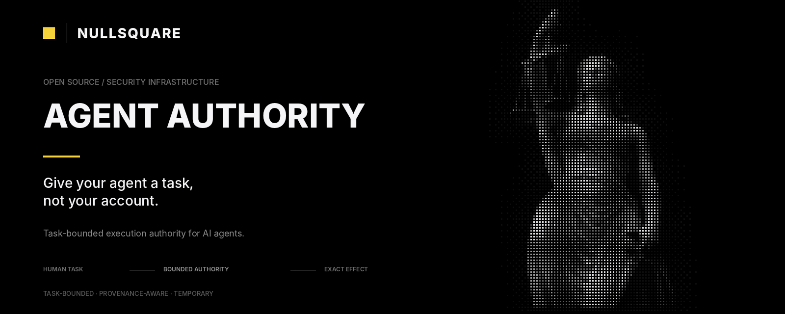

<div align="center">



# Agent Authority

### Give your agent a task, not your account.

**Agent Authority is a task-bounded execution layer for AI agents. It lets an agent use existing provider permissions only for the task the user actually authorized.**

[Quickstart](docs/quickstart.md) · [Task-first API](#task-first-api) · [AgentDojo proof](benchmarks/agentdojo/README.md) · [Security](SECURITY.md) · [Product proof](docs/product-proof.md) · [Contributing](CONTRIBUTING.md) · [Roadmap](ROADMAP.md)

> **Status: Community / Developer Preview. Not production-ready.** The goal of this stage is independent use, attack, benchmark reproduction and contribution—not a claim that Agent Authority replaces IAM, a sandbox, or production credential infrastructure.

</div>

## The problem

A user gives an agent a narrow task:

> **Handle this customer email.**

But the connected account may give the application broad standing permission to read many emails, create meetings with anyone, update unrelated records, or send messages to arbitrary recipients.

OAuth and IAM answer questions like:

> Can this application use Calendar?

Agent Authority asks a different question immediately before the effect:

> **Is this exact effect inside the task the user authorized?**

The target is:

```text
standing provider permission
          |
          v
   human-approved task
          |
          v
 temporary task authority
          |
          +--> useful task actions proceed
          +--> authority may follow resources discovered through authorized work
          +--> unrelated resources step up or deny
          |
          v
   task completes / expires
          |
          v
   task authority disappears
```

The provider credential may continue to exist. The **task authority does not**.

## Install

Requires Node.js 20+.

```bash
npm install @nullsquare/agent-authority
```

The preferred product surface is:

```js
import { createTask } from '@nullsquare/agent-authority/task';
```

That package path includes first-class TypeScript declarations in the Community Preview.

## Try it without credentials

From a blank directory:

```bash
npm init -y
npm install @nullsquare/agent-authority
curl -fsSL https://raw.githubusercontent.com/Null-Square/agent-authority/main/examples/quickstart.mjs -o quickstart.mjs
node quickstart.mjs
```

The quickstart demonstrates the essential behavior:

```text
ALLOW   -> useful task effect runs
STEP-UP -> unrelated resource is outside task authority
PASS    -> blocked request executes zero provider callbacks
```

Then try a real public GitHub read without a token:

```bash
curl -fsSL https://raw.githubusercontent.com/Null-Square/agent-authority/main/examples/quickstart-github-live.mjs -o quickstart-github-live.mjs
node quickstart-github-live.mjs
```

The Mission can represent broader standing `repo.read` capability while the Task Lease restricts the current task to `Null-Square/agent-authority`. An unrelated repository is stopped before a second network request.

See [docs/quickstart.md](docs/quickstart.md).

## Task-first API

The public mental model is deliberately small:

```text
Task -> Effect -> Authority
```

```js
import { createTask } from '@nullsquare/agent-authority/task';

const task = createTask({
  principal: 'user:me',
  agent: 'agent:assistant',
  request: 'Find the issue for this task and comment only on that issue',

  permissions: {
    github: {
      allow: ['issue.list', 'issue.comment'],
      deny: ['issue.close', 'repo.delete'],
      constraints: { repository: ['acme/app'] }
    }
  },

  authority: {
    repository: { kind: 'github.repository', value: 'acme/app' }
  },

  bindings: [
    {
      service: 'github',
      action: 'issue.list',
      field: 'repository',
      authority: 'repository'
    }
  ]
});

const discovery = await task.run({
  service: 'github',
  action: 'issue.list',
  context: { repository: 'acme/app' }
}, () => github.listIssues());

const issue = task.authorityFrom(discovery, {
  name: 'issue',
  kind: 'github.issue.number',
  from: 'repository',
  extractor: selectedIssueExtractor
});

task.bind({
  service: 'github',
  action: 'issue.comment',
  field: 'issue_number',
  authority: 'issue'
});

await task.run({
  service: 'github',
  action: 'issue.comment',
  context: { repository: 'acme/app', issue_number: issue.value, body: 'Handled.' }
}, () => github.comment(issue.value, 'Handled.'));
```

If the agent changes `issue_number` to an unrelated issue, the callback does not run. The result becomes an authority-delta step-up that can be explained to a human with `task.explain(error)`.

### Application-owned vs connected execution

Use `task.run(request, callback)` when your application already owns the SDK/provider call.

Use `task.execute(request)` when Agent Authority owns the connected-provider execution path and credential resolution stays behind its broker boundary.

Both paths use Task Lease semantics and the same deny/step-up model.

## Task authority can follow discovered resources

Many task resources are not known when the user gives the instruction. They are discovered while the task runs.

```text
repository = acme/app        (task-entry authority)
        |
        v
authorized issue discovery
        |
        +--> ALLOW receipt
        +--> guarded output evidence
        |
 reviewed extractor
        |
        v
issue = 42                   (derived task authority)
        |
        v
later effect may use issue 42
```

`task.authorityFrom()` uses the strict evidence path: the caller does not supply the derived authority value. The guarded output, ALLOW receipt, execution evidence and reviewed extractor must agree before the Task Lease resolves the value.

This is not remote-provider cryptographic attestation. Read [SECURITY.md](SECURITY.md) for the exact trust boundary.

## Narrow typed relations

Most bindings should remain exact. The Community Preview supports only three relation shapes:

| Relation | Meaning | Example |
| --- | --- | --- |
| `exact` | request must equal the established fact | only issue `42` |
| `oneOf` | request must equal one member of a finite established set | channel is `general` or `random` |
| `max` | numeric request must be no greater than the established ceiling | refund amount <= payment amount |

`exact` is the default.

Example finite-set binding:

```js
task.bind({
  service: 'slack',
  action: 'add_user_to_channel',
  field: 'channel',
  authority: 'allowedChannels',
  relation: 'oneOf'
});
```

Example numeric ceiling:

```js
task.bind({
  service: 'payments',
  action: 'refund.create',
  field: 'amount_minor',
  authority: 'paymentAmount',
  relation: 'max'
});
```

Unknown relations are rejected. Invalid relation/fact shapes fail closed. Requests outside the relation require an authority delta before the guarded effect runs.

`max` is a **per-effect ceiling**, not a cumulative ledger. Provider-side business state and idempotency remain authoritative for aggregate totals.

We deliberately do **not** expose a general policy expression language. New relation types should be justified by a real workflow or external benchmark first.

## What is already demonstrated

### Coding agent

The task-first coding proof establishes:

```text
repository -> issue -> base SHA -> task branch -> changed path -> draft PR
```

Writes to `main`, unrelated file paths and PRs from the wrong branch step up before mutation. Merge remains explicitly denied.

Run:

```bash
npm run demo:task-coding
```

### Support / communications

A Gmail-shaped authorized thread establishes the reviewed sender email as downstream authority for a Calendar-shaped attendee. Another thread or attendee executes zero provider-shaped callbacks.

### Operations / finance

A support ticket establishes an order, then a payment, then exact payment/currency authority plus a `max` amount ceiling. A legitimate partial refund can proceed; an unrelated payment, over-refund or wrong currency steps up before the refund callback.

Run:

```bash
npm run demo:task-finance
```

### AgentDojo external task set

The repository pins AgentDojo `0.1.35`, benchmark version `v1.2.2`, and a representative Slack task set.

The first oracle run exposed a finite-set policy gap in `user_task_11`: the legitimate task requires exactly two channels, `general` and `random`. That finding drove `oneOf` rather than a wildcard or general policy DSL.

The Community Preview regression gate for the selected oracle set is:

```text
selected tasks              5
mapped tasks                5
mapping coverage            100%
mapped-task completion      100%
unrelated-target block rate 100%
unauthorized effects        0
```

This is **oracle / upper-bound mapping evidence**, not a model-in-the-loop prompt-injection score. Reproduce it from [benchmarks/agentdojo/README.md](benchmarks/agentdojo/README.md).

## Core invariant

```text
Task Lease authority <= Mission authority
```

A Task Lease may narrow Mission authority. It cannot add an action that the Mission does not already allow.

Across durable state, transports and delegation, authority should stay equal or shrink—never silently grow.

## Existing stack, not a replacement stack

Agent Authority is designed to sit between agent reasoning and the provider path you already use:

```text
agent reasoning
      |
      v
Agent Authority
      |
      v
existing SDK / MCP / gateway / OAuth / provider
```

The repository demonstrates the same authority model across direct guard/SDK execution, MCP, connected-provider execution and a Vercel AI SDK protected-tool path.

## Connected GitHub

For local developer onboarding:

```bash
npx agent-authority setup
printf %s "$GITHUB_TOKEN" | npx agent-authority connect github --token-stdin
```

Then create a task with a runtime environment and call `task.execute(request)`. The current encrypted credential vault is a trusted-local-host developer backend, not production OAuth/KMS infrastructure.

See [docs/connected-github.md](docs/connected-github.md).

## Durability

The same task-first surface can opt into authenticated local Task Lease persistence/recovery by supplying the local store. Current durability includes exact Mission binding, authenticated state, stale-writer protection, local per-lease locking, durable completion/expiry and refresh before authority evaluation.

It is not a distributed transaction between arbitrary provider effects and local state.

See [docs/durable-task-leases.md](docs/durable-task-leases.md).

## Security boundary

The most important limitation is architectural:

> **Agent Authority cannot secure a provider path it does not control.**

If the model/agent can separately reach the same provider using another credential, shell, network tool or unguarded connector, that path can bypass Agent Authority.

Other current limits include:

- no cryptographic remote-provider attestation;
- no automatic source-data invalidation for already-derived authority;
- no automatic safe application of approved authority deltas;
- no crash-atomic distributed coupling of arbitrary remote effects and local Task Lease state;
- no production OAuth/KMS credential lifecycle;
- no hardened remote multi-tenant deployment;
- no trusted natural-language task-to-authority compiler;
- no claim that the oracle AgentDojo result proves model-in-the-loop prompt-injection resistance.

These are part of the current product contract, not hidden caveats. See [SECURITY.md](SECURITY.md).

## Validation

From a checkout:

```bash
npm install
npm run check
```

The repository also runs Node 20/22 CI, coverage, packed-consumer checks, CodeQL, connected GitHub validation, live GitHub proofs and the pinned AgentDojo oracle workflow.

The deterministic utility fixture remains available with:

```bash
npm run benchmark:task
```

## Why Community Preview now

The core mechanism is strong enough that the most valuable next evidence must come from people outside the project.

We want to learn:

- can a first-time developer protect a meaningful agent workflow quickly?
- where does the task-first API feel awkward or verbose?
- can external security researchers bypass the effect boundary?
- which real workflows require a relation the current narrow set cannot express?
- how does Agent Authority perform in model-in-the-loop AgentDojo runs?
- does an external developer keep the layer after trying it?

The Community Preview is how we gather that evidence. It is not a production-readiness declaration.

## Contributing

The most valuable contribution answers:

> **Can this agent complete the intended task while being technically unable to use the same standing account permission for an unrelated effect?**

Start with [CONTRIBUTING.md](CONTRIBUTING.md). Especially useful contributions include real task-first integrations, benchmark reproductions, adversarial tests, reviewed provider extractors, approval UX, TypeScript/API improvements, and independent quickstart feedback.

## License

Apache-2.0.
