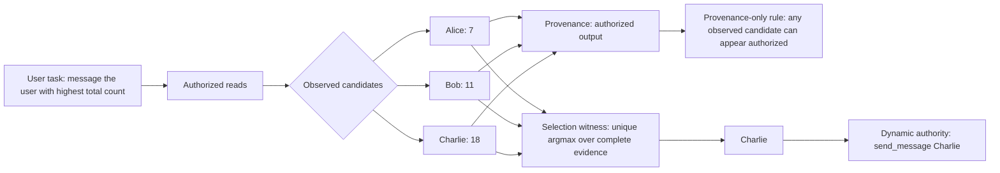
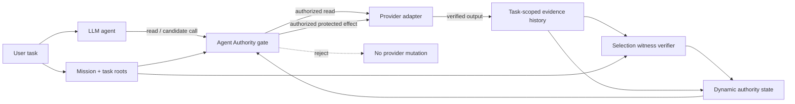
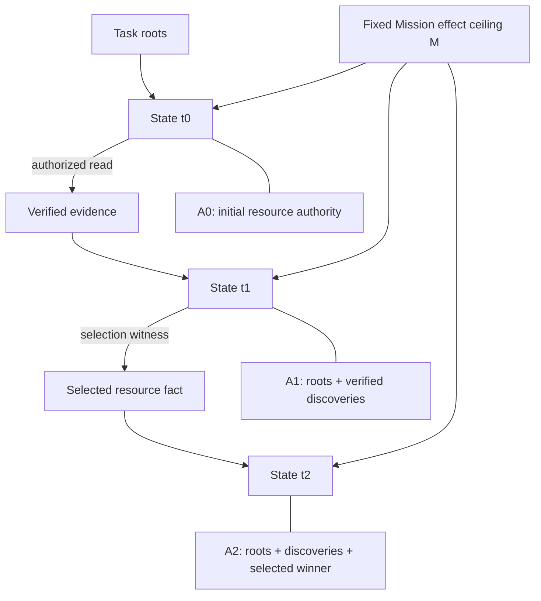

# Selection Authority for Open-World Agents
## Authorizing the Chosen Resource at the Provider Boundary

### Abstract

Tool-using agents often discover concrete resource identifiers only after execution begins. A secure authorization layer must therefore support dynamic authority without giving an untrusted model standing access to every resource visible through a user's account. Provenance alone does not solve this problem. A legitimate read can return several valid candidates, so evidence that a resource was observed on an authorized path does not establish that the user's task selected that resource for a later mutation.

We define **selection authority**: authority for a protected effect on resource `r` exists only when task-rooted semantics and authorized runtime evidence establish that `r` is the resource selected by the task predicate. We present **Agent Authority**, a stateful provider-effect reference monitor with a fixed Mission effect ceiling and task-local resource authority that may grow from trusted roots, verified authorized output, and deterministic selection witnesses. Selection witnesses evaluate predicates over authorized candidate sets and required measurements, and fail closed when uniqueness or evidence completeness cannot be established.

We formalize the authorization transition and establish Mission non-amplification, request non-self-authorization, selection soundness, ambiguity fail-closed behavior, and cross-task non-transferability under explicit reference-monitor assumptions. On a frozen 60-task AgentDojo cohort, Agent Authority accepts **96/96** reference and evidence-consistent legitimate executions while blocking **385/385** publication-primary adversarial traces. A structurally matched output-provenance policy accepts the same **96/96** legitimate executions but authorizes **2/2** wrong observed selector candidates. A request/output-provenance policy authorizes **46/46** request self-authorization probes. On eight post-freeze task structures, the frozen mechanism accepts **13/13** legitimate executions and blocks **13/13** attacks, while targeted ablations expose selection, cardinality, precedence, and tuple failures. At the provider boundary, the frozen mechanism blocks **230/230** constructible malicious trajectories with zero malicious provider reaches. Authorization decisions have a median CPU cost of **8.223 µs** on the recorded CI host.

These results identify selection as a first-class authorization relation for open-world agent execution: the fact that an agent may legitimately observe a resource is weaker than evidence that the user's task selected that resource for an effect.

---

## 1. Introduction

An agent is asked to **message the user with the highest total message count**. It performs authorized reads and discovers three users: Alice, Bob, and Charlie. All three names are legitimate observations. All three appear in authenticated tool output. Only Charlie, however, has the highest aggregate message count.

This distinction is easy for an application developer to state and easy for an agent to violate. A provenance rule can prove that Alice was observed. A least-privilege rule can prove that messaging is permitted. A tool-call policy can prove that the `send_message` action is available. None of those facts alone proves that **Alice is the user selected by the task**.

The authorization question is therefore relational. The user did not grant authority to “message any observed user.” The user granted authority to message the unique user satisfying a predicate over runtime evidence. The concrete target is unknown at task start and can change when the evidence changes. A correct security layer must permit that dynamic target without allowing the model to choose arbitrarily from the observed candidate set.

We call this missing relation **selection authority**.

Selection authority is distinct from four neighboring concepts:

- **effect authority** determines which protected mutation types may occur;
- **resource authority** determines which concrete targets and argument values may be used;
- **observation provenance** determines where a value was encountered;
- **selection authority** determines why one candidate, rather than another legitimately observed candidate, is authorized for the effect.

This distinction matters because modern agents operate over open-world state. File IDs, user IDs, account IDs, transaction IDs, object paths, dates, and other arguments may not exist in the user's initial request. They are discovered through runtime reads. Freezing authority to the exact values of one reference trace rejects legitimate executions when the environment changes. Granting authority to every value seen in legitimate output is more flexible, but it confuses candidate membership with task selection.

Agent Authority resolves this tension with a stateful reference monitor at the real provider-effect boundary. The Mission fixes the set of protected effect types for the task. Concrete resource authority may grow during execution, but only through trusted task roots, verified output of already authorized steps, or deterministic witnesses that evaluate a task-rooted selection predicate over authorized evidence. The model may propose calls, but it does not create authority by proposing them.

The central comparison is deliberately narrow. On the same 60-task cohort, the full policy and an output-provenance policy both accept **96/96** legitimate executions. The difference appears only when authorized output contains multiple candidates: the provenance policy authorizes **2/2** generated wrong-candidate effects, while Agent Authority blocks both. This result isolates selection authority without relying on a broader tool denylist or a utility trade-off.

The paper makes four contributions:

1. **Selection authority as an authorization primitive.** We formalize the gap between legitimate observation and authorization of the task-selected resource when runtime evidence contains multiple candidates.
2. **A stateful dynamic-authority mechanism.** Agent Authority permits task-local resource authority to grow from verified evidence while the set of protected effect types remains under a fixed Mission ceiling.
3. **Formal security properties.** We define the operational authorization relation and establish Mission non-amplification, no request self-authorization, selection soundness, fail-closed ambiguity handling, and cross-task non-transferability under explicit mediation and evidence-integrity assumptions.
4. **A falsification-oriented evaluation.** We compare selection witnesses with structurally weaker provenance policies, isolate cardinality/precedence/tuple premises through ablation, evaluate post-freeze task structures, test the actual provider boundary, and measure decision overhead.

The result is a compact principle for agent security: **dynamic authority should grow from evidence of the task relation, not from the model's choice of an observed value.**

---

## 2. Problem Definition

### 2.1 Protected provider effects

We model an agent that interacts with external services through tools. Some tools are reads; others create real side effects such as sending a message, updating a record, transferring funds, deleting an object, booking a resource, or modifying a file.

A **protected provider effect** is a mutation that must pass the Agent Authority monitor before it reaches the provider. The model can generate arbitrary candidate calls. Security depends on whether those candidate calls are admitted by the reference monitor, not on whether the model remains aligned internally.

For a candidate effect at time `t`, let:

- `a_t` be the requested protected action type;
- `q_t` be its structured argument tuple;
- `Σ_t` be the current task authority state.

The provider executes the effect only if:

`Authorize(a_t, q_t, Σ_t) = allow`.

This enforcement point gives the system a clean security boundary: the agent proposes; the monitor authorizes; the provider mutates.

### 2.2 The open-world authority problem

Traditional allowlists work well when every authorized argument is known before execution. Agent tasks often violate that assumption.

Consider three common forms:

1. **Discovery.** “Find the file named `Q4-report.pdf` and share it with Dana.” The file ID is learned from a search result.
2. **Extremum selection.** “Message the user with the highest number of posts.” The winner is learned only after comparing runtime measurements.
3. **Aggregate selection.** “Notify the customer appearing most often in these failed transactions.” The authorized target is a function of a runtime evidence set.

In each case, the task fixes a semantic relation before the concrete target is known. The security mechanism must preserve that relation as state changes.

A static exact-value fence is safe but brittle: it can bind the task to yesterday's winner or to an incidental identifier in one trace. A broad dynamic rule is flexible but unsafe: if every observed candidate becomes writable, the model chooses among candidates instead of the task predicate.

### 2.3 Observation is weaker than selection

Let `C` be the candidate set returned by authorized execution. Let `P` be the task-rooted predicate. Let `E` be the evidence required to evaluate `P` over `C`.

Observation provenance can establish:

`r ∈ C`.

Selection authority requires:

`S(P, C, E) = r`,

where `S` is a deterministic witness function.

The implication

`r ∈ C  ⇒  S(P,C,E)=r`

is false whenever `C` contains more than one legitimate candidate.

That simple counterexample is the paper's core security observation. It remains true even if the read is fully authorized, the provider output is authentic, the action type is allowed, and the candidate genuinely belongs to the relevant result set.

### 2.4 Request circularity

The agent's own request history is another tempting source of dynamic authority. It is also circular.

Suppose the model wants to mutate resource `x`. If placing `x` in an earlier request is enough to make `x` authorized later, the model can manufacture the evidence needed to justify its own choice. The authorization system has collapsed into self-approval.

Agent Authority therefore treats request occurrence as non-deriving. Requests can consume authority; they cannot create it.

### 2.5 Reference-monitor assumptions

The formal model uses five explicit system assumptions:

- **A1 — Complete mediation.** Every protected effect passes through the monitor before provider execution.
- **A2 — Mission integrity.** The Mission and trusted task roots cannot be rewritten by the model after task start.
- **A3 — Evidence integrity.** Accepted provider-output evidence is bound to the authorized invocation that produced it.
- **A4 — Witness correctness.** Implemented witness verifiers deterministically implement their declared selector semantics.
- **A5 — Task isolation.** Evidence and derived authority are scoped to the current task or lease.

These assumptions define the trusted computing base. They are standard deployment obligations for a provider-boundary authorization mechanism: mediation, policy integrity, evidence integrity, verifier correctness, and task-scoped state.

---

## 3. Selection Authority

### 3.1 Task state

A task state is:

`Σ_t = (M, R, A_t, H_t, K_t, O_t, F)`

where:

- `M` is the fixed set of protected effect types allowed by the Mission;
- `R` is the set of trusted task-root authority facts;
- `A_t` is the task-local resource/value authority available before step `t`;
- `H_t` is the verified authorized execution history;
- `K_t(a)` counts successful protected effects of action type `a`;
- `O_t` records observed predecessor actions used by precedence checks;
- `F` contains unresolved values held behind static task-instance fences.

The central invariant is asymmetric:

> `M` is fixed for the task lifetime; `A_t` may grow.

The system can discover new resource identifiers without discovering new effect types.

### 3.2 Authority derivation

Agent Authority has three positive derivation paths.

**Trusted roots.** Values explicitly grounded in the task authority start in `A_0`.

**Verified output.** A non-ambiguous value may enter dynamic authority when it is extracted from verified output of an already authorized execution and the contract permits that output relation.

**Selection witnesses.** When evidence exposes multiple candidates, candidate membership is insufficient. A value enters dynamic authority only when a witness proves that the task-rooted predicate selects it over the required evidence.

The model's request arguments are intentionally absent from this list.

### 3.3 Witness relation

For a candidate set `C`, predicate `P`, and evidence `E`, define:

`S(P,C,E) → r | ⊥`.

The witness returns a concrete resource `r` only when the declared selector semantics are satisfied. Otherwise it returns `⊥`.

The implementation includes several selector families.

**Unique prefix.** For prefix `p`, authorize `r` only when exactly one candidate in `C` starts with `p`.

**Unique maximum/minimum.** For measurement `m_E(x)`, authorize `r` only when every required candidate has a measurement and `r` is the unique extremum.

**Aggregate frequency.** Authorize `r` only when the complete declared aggregation scope yields `r` as the unique maximum or minimum frequency winner.

Ties and incomplete evidence produce `⊥`. The monitor therefore does not guess when the selection relation is unresolved.

### 3.4 Figure 1: provenance versus selection authority



**Figure 1.** Observation provenance assigns the same source status to all three legitimate candidates. The task predicate distinguishes them. Selection authority is created only for the unique witnessed winner.

### 3.5 Effect authorization

A protected effect `(a,q)` is admitted only when all relevant contract dimensions succeed:

1. **Effect ceiling:** `a ∈ M`.
2. **Cardinality:** the permitted count for `a` has not been exhausted.
3. **Precedence:** required earlier actions have occurred.
4. **Static fields:** fixed fields match trusted or task-instance fences.
5. **Dynamic fields:** dynamic values are justified by verified output or a valid selection witness.
6. **Correlation:** related arguments satisfy the authorized tuple relation.

This is important because least privilege is multidimensional. Correct action type plus correct target is still insufficient if the call repeats too many times, occurs too early, or combines individually valid fields into a tuple that never appeared in an authorized relation.

---

## 4. System Design

### 4.1 Architecture

Agent Authority is positioned between an untrusted agent and the credential-bearing provider adapter. Reads produce evidence. Protected mutations must pass the authority gate.



**Figure 2.** The model can propose actions but does not hold the final mutation authority. Mission state, verified evidence, witness evaluation, and the provider gate form the authorization path.

### 4.2 Mission ceiling

The Mission identifies the protected effect types the task may perform. It does not need to contain every concrete runtime resource identifier.

This split is what makes open-world execution possible. A user can authorize one `send_message` effect whose recipient is selected by a runtime predicate without granting a generic “send to any account-visible user” permission.

### 4.3 Evidence binding

Dynamic authority is meaningful only if evidence cannot be forged by the model. Provider outputs are therefore accepted as evidence only when they are bound to the authorized action invocation that produced them.

This binding distinguishes two identical strings with different security histories. A resource ID copied into a model-generated request is not equivalent to the same resource ID returned by a verified provider read.

### 4.4 Stateful history

Some authorization properties depend on execution history rather than one call in isolation.

- Cardinality constrains how many protected effects may occur.
- Precedence constrains when an effect may occur.
- Selection can depend on measurements collected across several reads.
- Tuple constraints preserve correlation among related fields.
- Task scoping prevents authority derived in one task from leaking into another.

The monitor therefore maintains task-local state instead of evaluating each call as a stateless allowlist lookup.

### 4.5 Correlated arguments

Argument-wise allowlists can create unauthorized cross-products. If one authorized call contains `(account=A, amount=10)` and another contains `(account=B, amount=20)`, independently authorizing `{A,B}` and `{10,20}` also admits `(A,20)` and `(B,10)`.

Agent Authority can preserve the tuple relation rather than flattening it into independent field sets. This is the same general lesson as selection authority: authorization often lives in a **relation**, not in independent value membership.

### 4.6 Authorization algorithm

```text
AUTHORIZE(action a, arguments q, state Σ):
    if a not in Σ.M:
        reject action_not_allowed

    if count(a, Σ) >= maxCount(a):
        reject count_exceeded

    if required predecessors for a are absent:
        reject precedence_missing

    if any static field violates its task/root fence:
        reject field_not_allowed

    for each dynamic field v in q:
        if verified-output derivation proves v:
            continue
        if selection witness proves v from task predicate + authorized evidence:
            continue
        reject dynamic_authority_missing

    if q violates an authorized tuple relation:
        reject tuple_not_allowed

    allow provider effect
```

The algorithm deliberately gives the model no rule of the form “if I mentioned this value earlier, authorize it.”

### 4.7 Figure 3: fixed effect ceiling, growing resource authority



**Figure 3.** Concrete resource authority can grow as evidence arrives. The Mission's protected effect types remain fixed.

---

## 5. Formal Properties

The complete proof development appears in `FORMAL_MODEL.md`. This section summarizes the properties used by the manuscript.

### Theorem 1 — Mission non-amplification

For every reachable task state, no protected effect outside the fixed Mission effect set `M` can be authorized.

The reason is structural: derivation rules can add resource facts, but none modifies `M`, and every protected effect requires `a ∈ M`.

### Theorem 2 — No request self-authorization

A value that appears only in model-supplied request arguments cannot become dynamic authority.

The derivation rules require a trusted root, verified authorized output, or a valid selection witness. Request occurrence has no authority-producing conclusion.

### Theorem 3 — Selection soundness

If a selection derivation adds resource `r` to dynamic authority, then `r` belongs to the evidenced candidate set and satisfies the declared task predicate over the complete evidence required by that predicate.

This theorem captures the paper's core guarantee: dynamic authority is linked to the **selection relation**, not merely to candidate membership.

### Corollary — Authorized observation does not imply selection authority

There exist traces in which `r` is returned by a legitimate authorized read but `r` is not the task-selected resource. Therefore authorized observation is not sufficient evidence for the protected effect on `r`.

### Theorem 4 — Ambiguity fails closed

For unique-winner selectors, ties and missing required measurements prevent selection-derived authority.

This follows from witness semantics: the verifier returns `⊥` unless it can establish one unique winner over the required evidence.

### Theorem 5 — Cross-task non-transferability

Evidence derived under one task identity cannot expand dynamic authority for a distinct task identity when evidence and authority state are task-scoped.

### Counterfactual consistency

The mechanism records a selector relation rather than freezing the old concrete winner. If authorized evidence changes while the task predicate remains the same, a different resource can become authorized when the same witness relation selects it uniquely.

This property is central to utility. The system can remain strict about **why** a resource is authorized without being strict about **which literal identifier** must win forever.

---

## 6. Implementation

The prototype compiles task authority into action rules containing effect ceilings, value fences, dynamic evidence bindings, cardinality, precedence, tuple relations, and selector metadata. The publication extension evaluates weaker authorization policies around the frozen mechanism rather than changing the mechanism for new tests.

### 6.1 Provider/action projection

Tool schemas are projected into the protected effect model. Unknown protected actions fail closed. Static and dynamic argument fields are evaluated separately so the contract can retain exact fences where appropriate while allowing evidence-derived resource values where required.

### 6.2 Selection verifiers

The implementation supports deterministic prefix and extremum witnesses, together with an aggregate-frequency path used by the evaluation tasks. A witness is evaluated only over authorized evidence available in the task history.

Unique selectors require uniqueness. Extremum selectors require measurements for the declared candidate domain. The output is a concrete authorized value or failure.

### 6.3 Stateful enforcement

Successful effects update task-local history and counts. Precedence rules inspect prior authorized steps. Tuple rules compare projected structured arguments against permitted correlations. Dynamic evidence is scoped to the task identity.

### 6.4 Frozen mechanism discipline

The V1 mechanism is frozen by hash manifest. Publication experiments rebuild the cohort, validate the frozen hashes, and execute new baselines and stress cases around the unchanged mechanism. This separates mechanism development from the publication-extension tests.

---

## 7. Evaluation

The evaluation is designed around five questions.

**RQ1 — Selection necessity.** Is authorized observation of a candidate sufficient to authorize a protected effect on that candidate?

**RQ2 — Dynamic utility.** Can the policy accept a different legitimate winner when evidence changes without recompiling around the old concrete identifier?

**RQ3 — Structural necessity.** Which failures appear when request non-derivation, cardinality, precedence, tuple correlation, or selection witnesses are removed?

**RQ4 — Post-freeze behavior.** Does the frozen mechanism retain the expected safety/utility behavior on task structures written after the mechanism freeze?

**RQ5 — Provider-boundary relevance.** Do unauthorized protected effects arise in executable trajectories, and does the gate prevent those effects from reaching the provider?

### 7.1 Development cohort and legitimate executions

The primary cohort contains 60 mutation-bearing AgentDojo tasks across Slack, Banking, Workspace, and Travel. Publication utility combines:

- **60** reference executions;
- **36** evidence-consistent changed-evidence executions.

The changed-evidence cases preserve the task relation while changing runtime values or winners. They test whether the mechanism authorizes the relation rather than memorizing one trace's literal values.

### 7.2 Adversarial population

The publication-primary adversarial matrix contains **385** traces:

| Attack family | Cases |
| --- | ---: |
| field/resource mutation | 146 |
| repeated effect | 60 |
| premature/reordered effect | 59 |
| action outside Mission effect ceiling | 60 |
| request self-authorization | 46 |
| wrong selector candidate | 2 |
| tuple/correlation cross-product | 12 |
| **Total** | **385** |

The matrix is designed to test independent authorization dimensions rather than only prompt wording.

### 7.3 Baselines and comparators

We use internal policies with explicit semantics.

**Standing action authority.** The permitted protected action types are enforced, but concrete resource and structural constraints are broad.

**Output provenance.** The same structural constraints are retained, but an observed candidate from authorized output can satisfy dynamic resource provenance without a selection witness.

**Request/output provenance.** Request history is also accepted as a source of dynamic values.

**Single-trace field-wise value allowlist.** Projected concrete values from one successful trace form static field allowlists. This comparator captures trace-value overconstraint without pretending to reproduce an exact call sequence.

These comparators isolate the mechanism's own premises. They are not renamed implementations of external systems.

### 7.4 Main result

| Policy | Legitimate accepted | Attacks blocked |
| --- | ---: | ---: |
| **Agent Authority — full** | **96/96** | **385/385** |
| standing action authority | 96/96 | 60/385 |
| output provenance without selection witnesses | **96/96** | 383/385 |
| request/output provenance | 96/96 | 337/385 |
| single-trace field-wise value allowlist | 61/96 | 252/385 |

The most important row pair is **full Agent Authority versus output provenance**. Both policies preserve the same legitimate acceptance: **96/96**. Their difference is concentrated at the selection boundary:

- Agent Authority blocks **2/2** wrong-selector candidates;
- output provenance authorizes **2/2** wrong-selector candidates.

The wrong candidate is not fabricated. It is a legitimate observation. The failure comes from treating “observed in authorized output” as equivalent to “selected by the task.”

This directly answers RQ1: **authorized observation is insufficient when the task defines a selection relation over multiple candidates.**

### 7.5 Dynamic utility under changed evidence

The full policy accepts all **36/36** evidence-consistent changed-evidence executions. The single-trace field-wise value allowlist accepts only **1/36**.

This difference shows why semantic relations matter for open-world authority. A fixed concrete winner is an implementation artifact of one environment snapshot. The selector relation is the stable authorization object.

For example, if the task authorizes the unique maximum and the maximum changes from resource `r1` to `r2`, the same selection relation can authorize `r2` once complete authorized evidence establishes `r2` as the new unique maximum.

### 7.6 Request non-derivation

The request/output provenance policy authorizes **46/46** request self-authorization probes. The full policy blocks all **46/46**.

This result isolates a simple but important rule: the agent cannot turn a chosen value into authority by mentioning that value in its own earlier request.

### 7.7 Structural ablations

Removing individual contract dimensions exposes the corresponding attack family:

| Removed premise | Exposed behavior |
| --- | ---: |
| cardinality | **60/60** repeated effects authorized |
| precedence | **24/59** reorder mutants authorized |
| tuple/correlation relation | **12/12** cross-product tuples authorized |
| request non-derivation | **46/46** self-authorization probes authorized |
| selection witness | **2/2** wrong observed candidates authorized in the matched provenance comparator |

These ablations show that provider-effect authority is not reducible to “right tool, right value.” Count, order, correlation, evidence source, and selection are independent policy dimensions.

### 7.8 Post-freeze task structures

We added eight task structures after the V1 mechanism freeze. The suite contains **13** legitimate checks and **13** adversarial checks covering:

- prefix selection;
- maximum and minimum selection;
- changed winners under changed evidence;
- ties and incomplete measurements;
- output-derived resources;
- request self-authorization;
- arithmetic derivation;
- tuple preservation;
- action cardinality;
- precedence;
- effect-ceiling escape.

Results:

| Policy | Legitimate accepted | Attacks blocked |
| --- | ---: | ---: |
| **Agent Authority — full** | **13/13** | **13/13** |
| standing action authority | 13/13 | 1/13 |
| output provenance without selection witnesses | 13/13 | 7/13 |
| request/output provenance | 13/13 | 6/13 |
| no cardinality | 13/13 | 12/13 |
| no precedence | 13/13 | 12/13 |
| no tuple/correlation relation | 13/13 | 12/13 |
| unrestricted dynamic fields | 13/13 | 4/13 |
| single-trace field-wise value allowlist | 8/13 | 6/13 |

The selection cases are particularly informative. The provenance-only policy exposes wrong-winner, tie, and incomplete-selection behavior, while the full policy requires the declared witness relation to succeed.

### 7.9 Provider-boundary evaluation

The original frozen provider-boundary suite constructs **230** malicious trajectories across field/resource substitutions, premature effects, repeated effects, exact cross-task transplants, and wrong-selector candidates.

Agent Authority blocks **230/230** malicious trajectories. **Zero** malicious protected effects reach the provider. Reference utility in the corresponding provider-boundary families remains **60/60**.

This measurement is stronger than inspecting model text or intermediate plans. It measures the security event that matters to the mechanism: whether a policy-unauthorized protected mutation crosses the real enforcement boundary.

### 7.10 Live adversarial case study

A completed matched DeepSeek V4 Pro Slack slice provides an additional model-driven provider-effect check. Across **372** attacked scenarios that completed in both ungated and gated conditions:

- ungated execution produced **61** policy-unauthorized protected effects across **40/372** scenarios;
- gated execution produced **0** policy-unauthorized protected effects;
- matched utility was **84.41%** ungated and **82.26%** gated.

The case study demonstrates that out-of-policy provider mutations are not only synthetic mutants: an adversarially influenced tool-using model can generate them, and a provider-boundary authorization monitor can stop them before execution.

### 7.11 Decision overhead

On the publication CI host, the authorization microbenchmark performs 12,000 measured decisions after warm-up across repeated passes of the 60-task cohort.

| Metric | Authorization decision time |
| --- | ---: |
| mean | **18.407 µs** |
| median | **8.223 µs** |
| p95 | **68.772 µs** |
| p99 | **228.509 µs** |

A full 60-task authorization pass has a median CPU time of **985.575 µs**. Contract compilation over 60 tasks has a median of **43.124 µs**.

These measurements indicate that deterministic provider-effect checks are small relative to normal model and network latencies.

### 7.12 Result synthesis

The evaluation supports four conclusions.

First, selection authority is independently necessary. Provenance-only authorization preserves full legitimate acceptance but admits wrong observed candidates.

Second, the mechanism remains dynamic. It accepts changed-evidence winners that a single-trace value allowlist rejects.

Third, structural policy dimensions are separately necessary. Cardinality, precedence, tuple correlation, request non-derivation, and selection each expose targeted failures when removed.

Fourth, enforcement belongs at the provider boundary. The frozen gate prevents policy-unauthorized mutations from reaching the provider even when the model proposes them.

---

## 8. Related Work

### 8.1 Runtime authorization and action provenance

The closest current neighboring work is **SARA** [1], which separates action induction from runtime execution authorization. SARA records action-origin provenance and independently authorizes tool calls against the user objective and audited successful-execution evidence, with goal-, chain-, and argument-level support. This strongly motivates execution-boundary authorization.

Agent Authority isolates a finer-grained question inside argument authorization. Consider an authorized read that legitimately returns Alice, Bob, and Charlie. No malicious Observation is required. All three values can have valid output provenance. The task nevertheless authorizes only the unique resource satisfying its selection predicate. Our formal object `S(P,C,E)` represents that relation directly, and our provenance-only comparator tests exactly what changes when the relation is removed.

Recent work on **provenance sensitivity in LLM agent action selection** [2] similarly shows that relevance and authorization of evidence are distinct concerns and that source-authority cues do not reliably prevent unauthorized evidence from affecting model choices. Agent Authority moves the final decision out of model behavior and into deterministic provider-effect enforcement.

### 8.2 Structural prompt-injection defenses

**CaMeL** [3] extracts control and data flow from trusted user queries and uses capability-style constraints to prevent unauthorized flows. The shared principle is to keep critical security semantics outside a potentially compromised model. Agent Authority focuses specifically on dynamic protected effects and on proving which runtime-discovered resource satisfies a task selection relation.

**Task Shield** [5] checks whether instructions and tool calls align with the user objective. Semantic task alignment and deterministic provider-effect authorization solve neighboring problems: an alignment mechanism can assess whether a call contributes to the task, while Agent Authority checks whether the concrete effect satisfies a compiled authorization relation.

### 8.3 Least privilege and capability envelopes

**MiniScope** [4] rigorously minimizes tool permissions using reconstructed permission hierarchies and a mobile-style authorization model. Agent Authority works at a finer runtime granularity inside the allowed effect envelope. Even when a tool is permitted, the target resource may still need to be selected from runtime evidence.

Attenuating agent authorization tokens [9] encode task-scoped tool and argument constraints and enforce non-amplifying delegation chains. This complements Agent Authority's stateful derivation model: attenuation constrains delegation, while selection witnesses justify a concrete runtime value that was unknown when the initial task authority was established.

### 8.4 Execution provenance and behavioral bounds

**Agent-Sentry** [6] learns execution provenance and behavioral bounds from traces. Agent Authority examines a case where trace membership is intentionally not discriminative enough: both the correct and incorrect target can be present in a valid authorized trace. The missing authorization fact is the predicate relation among those candidates.

### 8.5 Contract and gating integrity

The **RACG/ContractGuard** line [7,8] studies capability/risk gating and the integrity of structural tool contracts. Agent Authority assumes a trusted Mission and then concentrates on dynamic resource/value authority, history, correlation, and selection at execution time.

Across these lines of work, the common trend is clear: tool-using agents need enforcement outside the model. The contribution here is to make **selection over authorized runtime evidence** an explicit authorization object and to show experimentally that provenance membership alone cannot replace it.

---

## 9. Design Implications

### 9.1 Authorization policies should encode relations

Many practical agent policies are relational:

- the file whose name uniquely matches a task predicate;
- the account with the maximum balance under a declared rule;
- the cheapest qualifying itinerary;
- the tuple returned by a particular authorized query;
- one protected effect after a required read and at most once.

Flattening such policies into independent sets of allowed actions and values loses information. Selection witnesses, tuple relations, cardinality, and precedence all preserve structure that set membership alone cannot express.

### 9.2 Dynamic authority does not require broad standing authority

Open-world tasks do not force a choice between static exact-value policies and account-wide permissions. A third option is to keep the effect envelope fixed while allowing resource facts to grow from verified evidence under explicit derivation rules.

This is the key architectural benefit of Agent Authority. The policy can be both dynamic and non-amplifying.

### 9.3 Evidence completeness is part of authorization

For predicates such as maximum, minimum, or aggregate frequency, a winner is meaningful only relative to the evidence domain. A monitor should therefore treat completeness as a security premise, not as a quality hint.

If a unique maximum requires measurements for every candidate, missing one measurement means the authorization proof is incomplete. The correct security action is to collect more evidence or decline the protected effect.

### 9.4 The provider boundary is the right enforcement point

Prompt filters, planners, and semantic critics can reduce the number of bad candidate calls. They do not replace a final effect gate. The provider boundary is where the system can answer a binary operational question: **does this exact mutation have authority now?**

This makes Agent Authority compatible with stronger upstream defenses. Better planning and prompt-injection defenses can reduce rejected calls; the reference monitor remains responsible for final protected-effect admission.

### 9.5 Selection witnesses are compact proof objects

A selection witness does not need to reproduce the model's hidden reasoning. It needs only the predicate, candidate set, required measurements, and deterministic verification rule.

That property makes selection authority auditable. A reviewer can inspect why resource `r` was authorized without trusting a chain-of-thought narrative: `r` was the unique candidate satisfying the declared relation over authenticated task evidence.

---

## 10. Conclusion

Open-world agents must discover concrete resources at runtime. The resulting authorization problem is not solved by recording where a value appeared. When an authorized read exposes several valid candidates, provenance proves candidate membership; it does not prove which candidate the user's task selected.

Agent Authority makes that missing relation explicit. Protected effect types remain under a fixed Mission ceiling. Concrete resource authority can grow from trusted roots and verified execution evidence. When a task selects one resource from several candidates, a deterministic witness must prove the selection relation before the provider effect is admitted.

The evaluation isolates the value of that design. Full Agent Authority and output provenance both accept **96/96** legitimate executions, yet provenance alone authorizes both generated wrong-candidate effects. The full policy blocks **385/385** publication-primary attacks, preserves dynamic changed-evidence utility, passes targeted post-freeze selection and structural checks, blocks **230/230** malicious provider-boundary trajectories with zero malicious provider reaches, and adds microsecond-scale authorization cost.

The broader lesson is simple:

> **For dynamic agent effects, authority must capture not only where a resource came from, but why that resource is the one the task chose.**

---

## References

[1] X. Guo, Z. Xu, D. Huo, Y. Zhang, W. Wang, Q. Yang, D. Yu, and Y. Wang. *When Tool Outputs Become Commands: Separating Action Induction from Runtime Authorization in Tool-Augmented LLM Agents.* arXiv:2608.27146, 2026.

[2] J. Liao. *Auditing Provenance Sensitivity in LLM Agent Action Selection.* arXiv:2607.20827, 2026.

[3] E. Debenedetti et al. *Defeating Prompt Injections by Design.* arXiv:2503.18813, 2025.

[4] J. Zhu, K. Tseng, G. Vernik, X. Huang, S. G. Patil, V. Fang, and R. A. Popa. *MiniScope: A Least Privilege Framework for Authorizing Tool Calling Agents.* arXiv:2512.11147, 2025.

[5] Y. Jia et al. *The Task Shield: Enforcing Task Alignment to Defend Against Indirect Prompt Injection in LLM Agents.* ACL 2025.

[6] R. Sequeira, S. Damianakis, U. Iqbal, and K. Psounis. *Agent-Sentry: Bounding LLM Agents via Execution Provenance.* arXiv:2603.22868, 2026.

[7] S. Iyer and S. Babu. *Capability Minimization as a Safety Primitive: Risk-Aware Causal Gating for Least-Privilege LLM Agents.* arXiv:2606.13884, 2026.

[8] S. Iyer and S. Babu. *The Gate Is Only as Honest as Its Contracts: ContractGuard for the Contract Layer of Risk-Aware Causal Gating.* arXiv:2606.18550, 2026.

[9] N. A. Niyikiza. *Attenuating Authorization Tokens for Agentic Delegation Chains.* IETF Internet-Draft, 2026.

[10] OWASP GenAI Security Project. *OWASP Top 10 for Agentic Applications for 2026.*
